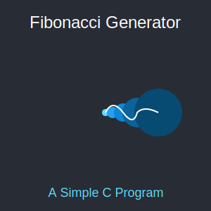

# Fibonacci Generator in C 🚀
---
[In Python]()

[In Python GUI]()




---
This project is a simple **C program** that generates the Fibonacci sequence up to a specified number of terms. The Fibonacci sequence is a series of numbers where each number is the sum of the two preceding ones, usually starting with 0 and 1.

### 📚 Table of Contents
1. [Features](#features)
2. [How the Program Works](#how-the-program-works)
3. [How to Run the Program](#how-to-run-the-program)
4. [Sample Output](#sample-output)
5. [FAQs](#faqs)


---

## 🌟 Features <a name="features"></a>
- Generates the Fibonacci sequence up to any given number of terms.
- Easy-to-use terminal interface with formatted input/output.
- Simple and fast execution for educational and practical use.

---

## 🧠 How the Program Works <a name="how-the-program-works"></a>
1. **Input**: The user is prompted to enter the number of terms for the Fibonacci sequence.
   - If the input is a **valid positive integer**, the program will generate and display the Fibonacci sequence up to that many terms.
   - If the input is **invalid (e.g., negative or zero)**, the program will ask the user to enter a valid input.
   
2. **Processing**: The program calculates each number in the sequence using the formula:
   ```
   F(n) = F(n-1) + F(n-2)
   ```
   where `F(1) = 0` and `F(2) = 1`.

3. **Output**: The program outputs the Fibonacci sequence in a well-formatted way on the terminal.

---

## 🖥️ How to Run the Program <a name="how-to-run-the-program"></a>

### Step 1️⃣: Install C Compiler
First, ensure you have a **C compiler** installed on your machine. If not, install one:

- **Linux/Mac**: Use `gcc`, usually installed by default, or install it via terminal:
  ```bash
  sudo apt install gcc        # Ubuntu/Debian-based systems
  brew install gcc            # macOS with Homebrew
  ```
  
- **Windows**: Install **MinGW** or use an IDE like **Code::Blocks** or **Visual Studio**.

### Step 2️⃣: Download the Source Code
Clone or download this repository to your local machine:
```bash
git clone https://github.com/mdriyadkhan585/fibonacci-sequence-generator.git
cd fibonacci-sequence-generator
```

### Step 3️⃣: Compile the Program
Use a C compiler like `gcc` to compile the program:
```bash
gcc fibonacci.c -o fibonacci
```

### Step 4️⃣: Run the Program
Execute the compiled program:
```bash
./fibonacci
```

You'll see an interface like this:
```
====================================
     Fibonacci Sequence Generator   
====================================
Enter the number of terms you want to generate: 
```

---

## 👀 Sample Output <a name="sample-output"></a>

Here's an example of what the program will output when you input `6` as the number of terms:

```
====================================
     Fibonacci Sequence Generator   
====================================
Enter the number of terms you want to generate: 6

Fibonacci Sequence up to 6 terms:
0, 1, 1, 2, 3, 5

====================================
           Program Ended            
====================================
```

### 🎉 Program Features:
- **Formatted Output**: The Fibonacci sequence is displayed in a user-friendly format.
- **Error Handling**: If you enter a non-positive integer, the program will ask you to re-enter a valid value.

---

## ❓ FAQs <a name="faqs"></a>

### 1. What is the Fibonacci Sequence? 
The Fibonacci sequence is a series of numbers in which each number is the sum of the two preceding numbers, typically starting with 0 and 1.

### 2. Can I generate any number of terms?
Yes! Simply enter the desired number of terms, and the program will calculate the sequence up to that point. However, note that larger inputs may take more time to calculate.

### 3. How do I modify the program to generate an infinite sequence?
This program is designed to generate a fixed number of terms. If you wish to generate an infinite sequence, you would need to implement a **loop** without a fixed limit (though this would run forever unless stopped).

---

## 📝 License
This project is licensed under the MIT License - see the [LICENSE](LICENSE) file for details.

Happy coding! 💻✨

---
